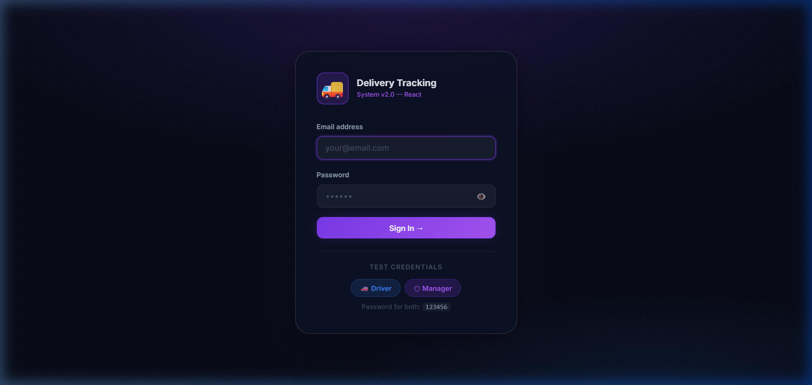
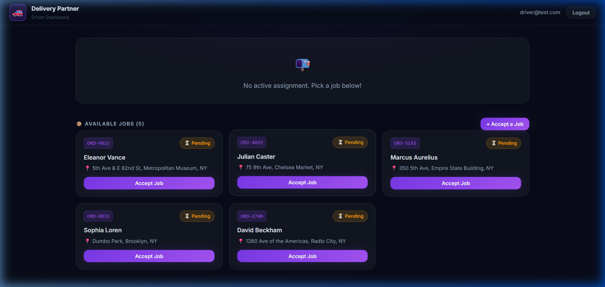
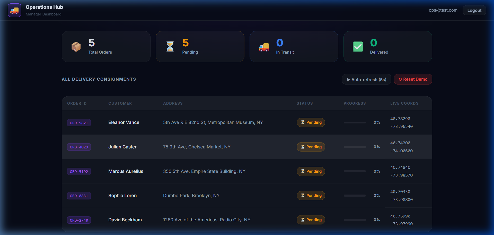

# 🚚 Delivery Tracking System

A real-time delivery tracking web application built with **React** (Create React App). Supports two roles — **Driver** and **Manager** — with live GPS simulation, order management, and a sleek dark glassmorphism UI.

---

## 📸 Screenshots

### 🔐 Login Page


### 🚗 Driver Dashboard


### 📊 Manager Dashboard


---

## ✨ Features

- 🔐 **Role-based login** — Driver & Manager roles with separate dashboards
- 📦 **Driver Dashboard** — Accept jobs, start transit, simulate GPS movement, mark delivered
- 🛡️ **Manager Dashboard** — Fleet overview, live coordinates table, order stats, auto-refresh every 5s
- 📍 **GPS simulation** — Real-time coordinate updates with animated progress bar
- 🎨 **Dark glassmorphism UI** — Premium design with smooth animations and micro-interactions
- ⚡ **Zustand state management** — Lightweight, fast global state

---

## 🚀 Getting Started

### Prerequisites
- Node.js (v16 or above)
- npm

### Installation & Run

```bash
# Clone the repository
git clone https://github.com/tulasi251/delivery-tracking-system.git

# Navigate into the project
cd delivery-tracking-system

# Install dependencies
npm install

# Start the app (opens browser at http://localhost:3000 automatically)
npm start
```

---

## 🔑 Test Credentials

| Role    | Email           | Password |
|---------|-----------------|----------|
| 🚗 Driver  | `driver@test.com`  | `123456` |
| 📊 Manager | `ops@test.com`     | `123456` |

---

## 🗂️ Project Structure

```
delivery-tracking-system/
├── public/
│   └── index.html          ← HTML template (CRA)
├── src/
│   ├── index.js            ← App entry point
│   ├── App.jsx             ← Root component (routing by role)
│   ├── App.css             ← Global styles (dark theme + glassmorphism)
│   ├── components/
│   │   ├── OrderCard.jsx   ← Reusable order card
│   │   ├── ProgressBar.jsx ← Animated delivery progress
│   │   └── StatusBadge.jsx ← Color-coded status pills
│   ├── pages/
│   │   ├── LoginPage.jsx      ← Login with role selection
│   │   ├── DriverDashboard.jsx   ← Driver view
│   │   └── ManagerDashboard.jsx  ← Manager view
│   ├── store/
│   │   └── useStore.js     ← Zustand global state
│   └── services/
│       └── trackingService.js ← GPS simulation logic
├── screenshots/            ← App output screenshots
├── package.json
└── README.md
```

---

## 🧭 Driver Flow

1. Login with `driver@test.com` → see available jobs
2. **Accept a job** → status becomes `Picked Up`
3. **Start Transit** → GPS simulation begins
4. **Live Track** → coordinates update every 3 seconds with progress bar
5. **Mark Delivered** → job completed

## 📋 Manager Flow

1. Login with `ops@test.com` → see fleet stats (Total / Pending / In Transit / Delivered)
2. View all orders with live GPS coordinates in a table
3. **Auto-refresh** → dashboard updates every 5 seconds automatically
4. **Reset demo data** → all orders reset to Pending

---

## 🛠️ Tech Stack

| Technology | Purpose |
|-----------|---------|
| React 18 | UI framework |
| Create React App | Tooling / bundler |
| Zustand | State management |
| Vanilla CSS | Styling (glassmorphism, dark theme) |
| Google Fonts (Inter) | Typography |

---

## 📜 License

MIT