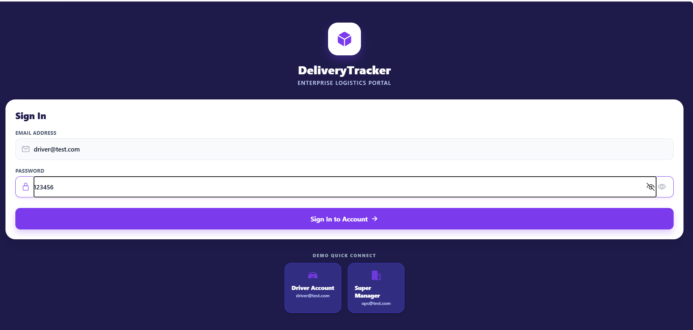
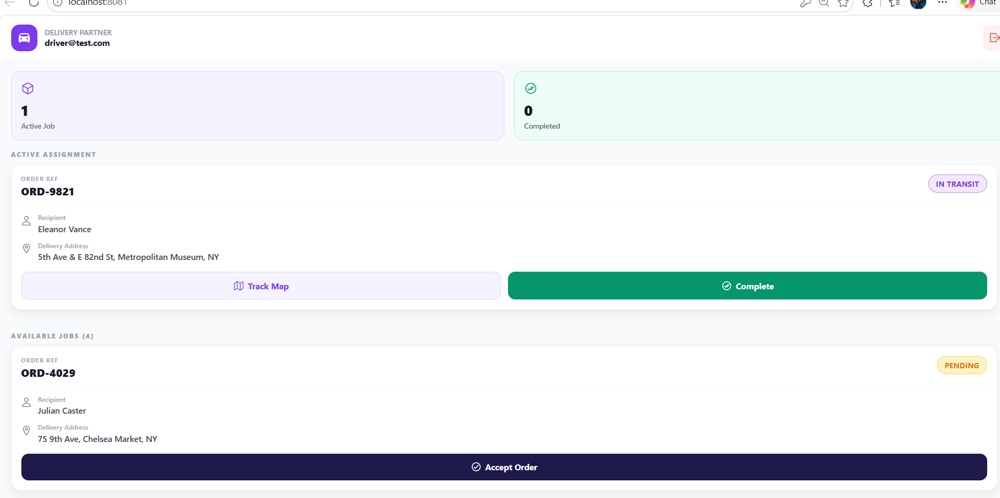
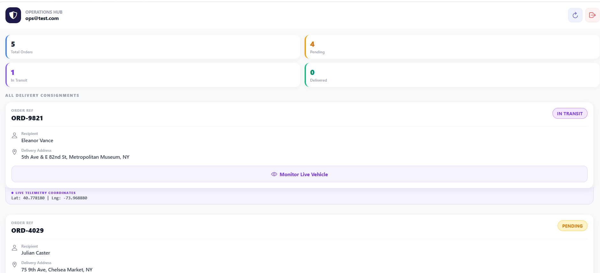

# DeliveryTracker

A high-fidelity React Native mobile application built with **Expo**, featuring real-time map visualization and telemetry simulation for logistics operations.

---

## Key Features

* **Multi-Role Support**: Custom screen states and action controls tailored for both **Delivery Drivers** and **Super Managers**.
* **Simulated Telemetry**: GPS movement engine that smoothly interpolates courier coordinates from warehouse pickup to delivery destination.
* **Interactive Map Tracking**: Integration of **Leaflet** maps within an optimized `WebView` container, showing live vehicle markers, customer location badges, and custom polyline routes.
* **Persistent Sessions**: Automated login restore utilizing **AsyncStorage** for smooth operational continuity.
* **Zustand State Engine**: Lightweight, highly reactive memory store sharing status and coordinate telemetry between roles instantly on the same device.

---

##  Tech Stack & Dependencies

* **Framework**: React Native (Expo SDK 56)
* **State Management**: Zustand
* **Storage**: `@react-native-async-storage/async-storage`
* **Navigation**: `@react-navigation/native` & `@react-navigation/native-stack`
* **Map Engine**: Leaflet inside `react-native-webview`
* **Design & Icons**: Vanilla StyleSheet with HSL-balanced palettes and Ionicons

---

##  Project Structure

```text
src/
├── components/
│   ├── MapView.js         # Leaflet Map renderer using WebView and JS injection
│   ├── OrderCard.js       # Presentation card with conditional action trigger states
│   └── StatusBadge.js     # Color-coded indicator for delivery phase statuses
├── navigation/
│   └── AppNavigator.js    # Stack routing with local session restoration validation
├── screens/
│   ├── LoginScreen.js     # Glassmorphic sign-in panel with quick shortcut buttons
│   ├── DriverDashboard.js # Driver job accept and step-by-step lifecycle flow
│   ├── ManagerDashboard.js# Live operations feed with driver coordinate logs
│   └── TrackingScreen.js  # Dedicated fullscreen tracking layout
├── services/
│   └── trackingService.js # Coordinate step interpolation simulation loop (3s ticks)
└── store/
    └── useStore.js        # Global state and authentication logic implementation
```

---

## Demo Access Credentials

The application uses local credentials validation for ease of demonstration:

| Role | Username / Email | Password | Details |
| :--- | :--- | :--- | :--- |
| **Delivery Driver** | `driver@test.com` | `123456` | Handles order acceptance, status transition, and GPS simulation. |
| **Super Manager** | `ops@test.com` | `123456` | Monitors order lists, views coordinates, and displays real-time markers. |

---

##  Setup & Execution Instructions

Follow these steps to run the application locally:

### 1. Install Dependencies
Navigate to the root directory and install npm packages:
```bash
npm install
```

### 2. Start the Development Server
Launch the Expo CLI:
```bash
npx expo start
```

### 3. Run on Device or Emulator
From the Expo CLI console, you can select how you want to run the project:
* **Physical Device**: Download the **Expo Go** app on your Android or iOS device, then scan the QR code displayed in your terminal.
* **Android Emulator**: Press `a` (requires Android Studio Emulator running).
* **iOS Simulator**: Press `i` (requires Xcode on macOS).
* **Web Browser**: Press `w` (loads in local browser window).

---

## 🧪 Simulation Walkthrough & Verification

1. **Quick Connect**: Launch the app to view the Login Screen. Under the inputs, tap **Driver Account** to auto-log in as the courier.
2. **Accept Job**: Find a job (e.g., `ORD-9821`) under **Available Jobs** and tap **Accept Order**. The status updates to **Picked Up** and shifts to the top of the dashboard under **Active Assignment**.
3. **Start Delivery**: Tap **Start Delivery**. The order status updates to **In Transit**, which automatically triggers the live tracking GPS simulation.
4. **View Tracking Map**: Tap **Track Map** on the active order card to view the Leaflet Map. You will see:
   * The purple/blue driver dot pulsing.
   * The red customer destination marker.
   * A dashed polyline connecting them.
   * Every 3 seconds, the driver dot moves closer to the destination, and coordinates in the bottom panel update.
5. **Switch to Manager**: Return to the driver home, tap the logout icon (top right), then tap **Super Manager** quick login.
6. **Live Telemetry Monitoring**: On the manager dashboard, scroll down to `ORD-9821`. You will see the status **In Transit** and the numerical **Live Telemetry Coordinates** updating in real-time.
7. **Track on Map**: Tap **Monitor Live Vehicle** to open the tracking map. You will see the vehicle position updating in real-time, matching the driver's screen progress.
8. **Completion**: If you switch back to the driver or stay on the manager screen, the simulation will automatically transition to **Delivered** when the driver marker reaches the customer's coordinate, ending the simulation loop and marking it completed.
9. **Reset State**: Click the circular arrow icon in the top right of the Manager Hub to reset all orders back to **Pending** at any time.

## Output


